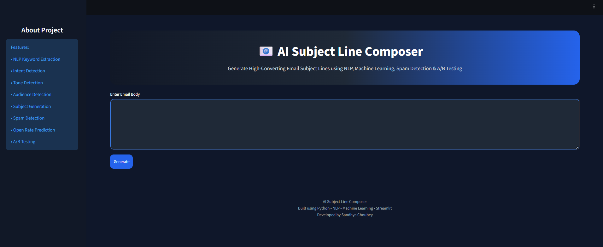
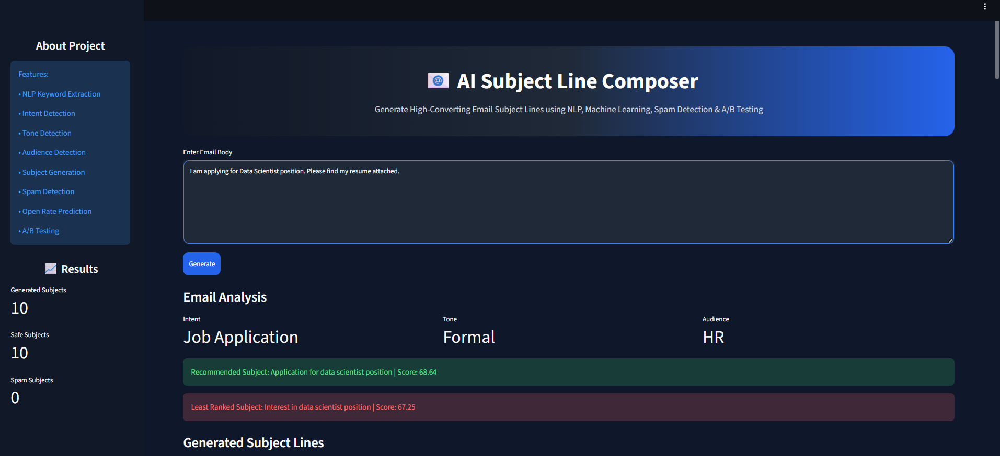
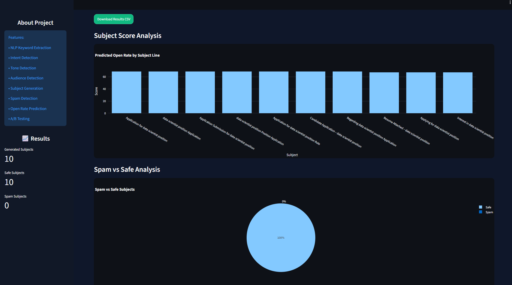
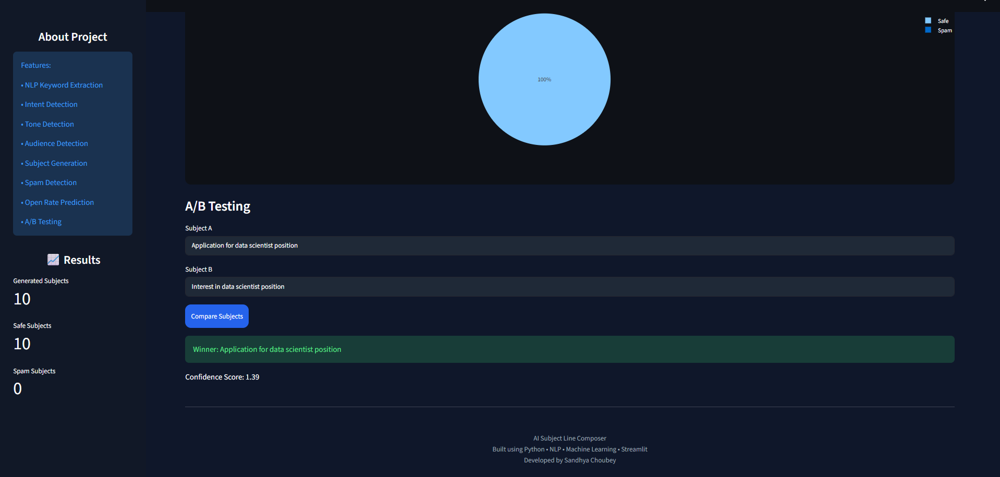

# AI Subject Line Composer

## Overview

AI Subject Line Composer is a Machine Learning and NLP-based web application that generates effective email subject lines from email content.

The application analyzes the email body, identifies intent, tone, and audience, generates multiple subject line suggestions, predicts their effectiveness, detects spam-like content, and supports A/B testing for subject line comparison.

---

## Features

* NLP Keyword Extraction
* Intent Detection
* Tone Detection
* Audience Detection
* Automated Subject Line Generation
* Spam Detection
* Open Rate Prediction
* A/B Testing
* CSV Export
* Interactive Visualizations

---

## Technology Stack

* Python
* Streamlit
* Pandas
* Scikit-learn
* Plotly
* NLTK

---

## Folder Structure

 AI_SUBJECT_COMPOSER/
├── assets/                  # UI assets and logos
├── data/                    # Datasets (Emails, Spam, Subject lines)
├── models/                  # Trained ML models and TF-IDF vectorizers (.pkl)
├── screenshots/             # App screenshots for documentation
├── training/                # Scripts to train audience, intent, spam, & tone models
├── utils/                   # Core NLP, detection, scoring, and A/B testing logic
├── app.py                   # Main Streamlit web application
├── README.md                # Project documentation
└── requirements.txt         # Python project dependencies

---

## Installation & Setup

Follow these steps to set up and run the project locally on your machine.

### Prerequisites
* **Python 3.9+** installed
* **Git** installed

### Setup Instructions

1. **Clone the repository**
   ```bash
   git clone https://github.com
   cd AI_SUBJECT_COMPOSER
   ```

2. **Create a virtual environment (Recommended)**
   * **Windows:**
     ```bash
     python -m venv venv
     venv\Scripts\activate
     ```
   * **macOS / Linux:**
     ```bash
     python3 -m venv venv
     source venv/bin/activate
     ```

3. **Install dependencies**
   ```bash
   pip install --upgrade pip
   pip install -r requirements.txt
   ```

4. **Download NLP resources**
   *(Run this once to download the required NLTK datasets for text preprocessing)*
   ```bash
   python -c "import nltk; nltk.download('punkt'); nltk.download('stopwords'); nltk.download('wordnet')"
   ```

5. **Train the models (Optional)**
   *(If you want to re-train the ML models using the dataset files inside the `data/` folder, execute the scripts inside `training/`. Otherwise, skip this step to use the pre-trained models inside `models/`.)*
   ```bash
   python training/train_subject_model.py
   ```

6. **Run the Application**
   ```bash
   streamlit run app.py
   ```


---

## Project Workflow

1. User enters email content.
2. Text is cleaned using NLP preprocessing.
3. Keywords are extracted.
4. Intent, tone, and audience are identified.
5. Multiple subject lines are generated.
6. Machine Learning model predicts effectiveness score.
7. Spam detection is performed.
8. Best subject line is recommended.
9. A/B testing compares subject line performance.
10. Results can be exported as CSV.

---

## Screenshots

<p align="center">

</p>

<p align="center">

</p>

<p align="center">

</p>

<p align="center">

</p>

<p align="center">

</p>

---

## Future Enhancements

* Generative AI based subject generation
* Email personalization
* Multilingual support
* Advanced analytics dashboard

---

## Developer

Sandhya Choubey

B.Tech Computer Science Engineering

AI / Machine Learning Enthusiast
